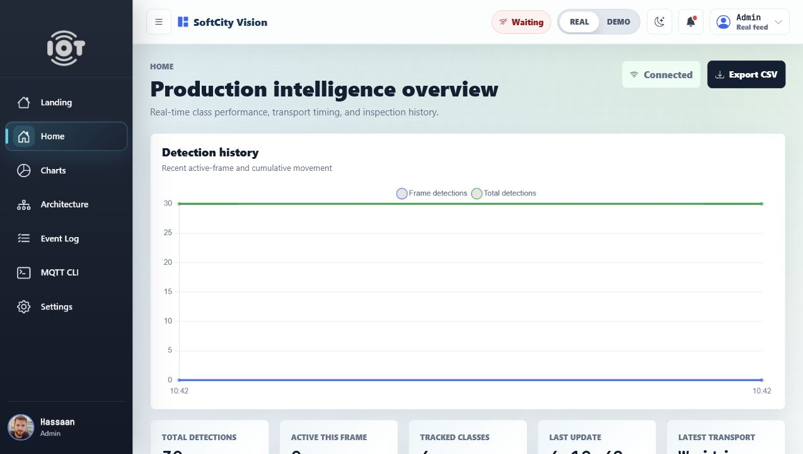
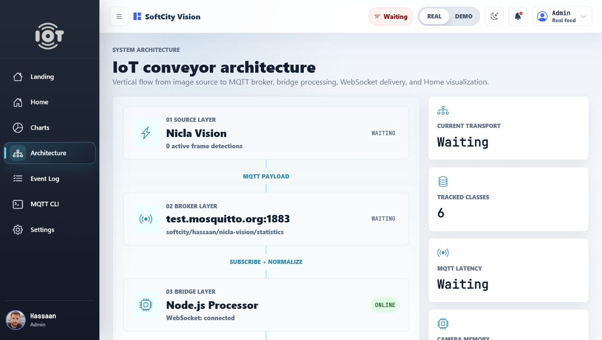
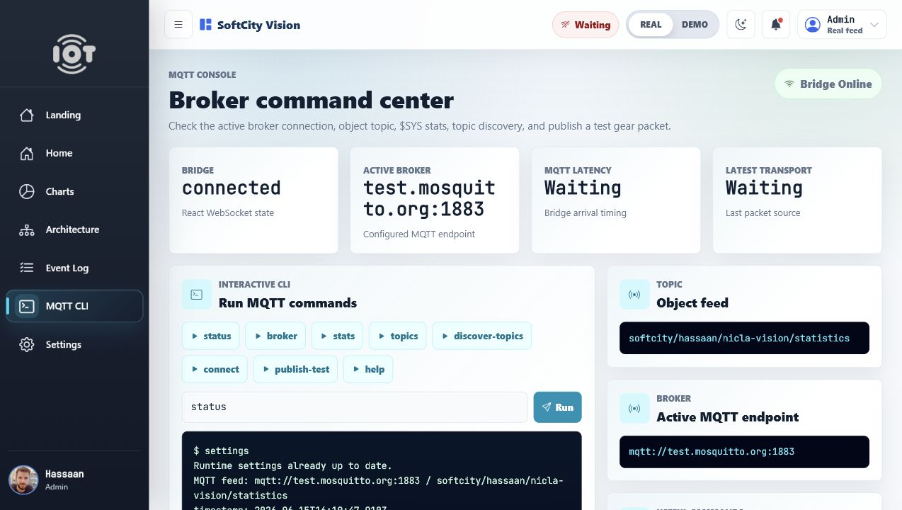

# Product Detection Analytics App

Production-style IoT dashboard for Nicla Vision gear detection on a conveyor line. The app receives MQTT detection packets through a Node.js bridge, streams them to React over WebSocket, and presents live class counts, transport latency, broker diagnostics, camera memory telemetry, event logs, and analytics charts.

## App Preview

### Home


### Architecture


### MQTT CLI


## Key Features

- Real-time MQTT ingestion for Nicla Vision detection packets.
- Node.js MQTT-to-WebSocket bridge for browser-safe live updates.
- Public, local, or custom MQTT broker configuration from the Settings page.
- Browser MQTT CLI with broker status, `$SYS/#` stats, topic discovery, reconnect, and publish-test commands.
- Live Home dashboard with gear totals, latest detection history, latency, and class status.
- Advanced analytics views with line, bar, pie, donut, scatter, radar, gauge, and distribution charts.
- Architecture page showing source, broker, bridge, React delivery, camera RAM, and ROM telemetry.
- Event log for packet, CLI, connection, mode, and alert activity.
- Responsive layout for desktop and modern mobile devices.

## MQTT Packet Shape

The bridge accepts real camera packets with either `statistics`, `frame`/`total`, or detection-event fields. A typical packet:

```json
{
  "source": "nicla_vision_camera",
  "transport": "mqtt",
  "frame": {
    "SmallWheel": 1,
    "LargeYellowGear": 0
  },
  "total": {
    "SmallWheel": 14,
    "LargeYellowGear": 11
  },
  "cameraMemory": {
    "ramFreeBytes": 350000,
    "romUsedBytes": 1270000,
    "romTotalBytes": 2048000
  },
  "publish_duration_ms": 12,
  "sent_at_ms": 1781534465009,
  "timestamp": 1781534465
}
```

Tracked classes:

- `LargeGreenGear`
- `LargeYellowGear`
- `GreenStar`
- `SmallWheel`
- `SmallHelicalGearYellow`
- `SmallRoundGearYellow`

## Quick Start

Install dependencies:

```bash
npm install
```

Run React and the MQTT/WebSocket bridge together:

```bash
npm start
```

Open:

- React app: [http://localhost:3000](http://localhost:3000)
- WebSocket bridge: `ws://localhost:8080`

Build for production:

```bash
npm run build
```

## MQTT Configuration

Default broker:

```text
mqtt://test.mosquitto.org:1883
```

Default object topic:

```text
softcity/hassaan/nicla-vision/statistics
```

Use the Settings page to switch between:

- Public test broker
- Local Mosquitto
- Custom MQTT broker

The app syncs saved broker settings to the Node bridge when the WebSocket connects.

## MQTT CLI Commands

Available from the MQTT CLI route:

```text
status
broker
stats
topics
discover-topics
discover-topics softcity/hassaan/#
discover-all
connect
publish-test
help
```

Topic discovery is time-boxed because MQTT brokers do not expose a true topic directory. The app temporarily subscribes to a wildcard filter and reports topics that publish during the discovery window.

## Project Structure

```text
Mqtt-demo/Subscriber.js        Node MQTT subscriber + WebSocket bridge
src/Context/                   App state, WebSocket, MQTT packet normalization
src/pages/analytics/           Home dashboard
src/pages/charts/              Analytics chart gallery
src/pages/examTools/           Architecture and event log pages
src/pages/mqttCli/             Browser MQTT CLI
src/pages/settings/            Runtime MQTT and bridge settings
docs/screenshots/              README screenshots
```

## Tech Stack

- React 18
- React Router
- Chart.js and react-chartjs-2
- Node.js
- mqtt.js
- ws WebSocket server
- Bootstrap Icons

## Notes

- Real mode waits for MQTT packets from the camera.
- The MQTT bridge supports QoS 1 subscriptions and publish-test packets.
- Public brokers may expose limited `$SYS/#` stats; topic discovery works only for topics that publish during the listening window.
